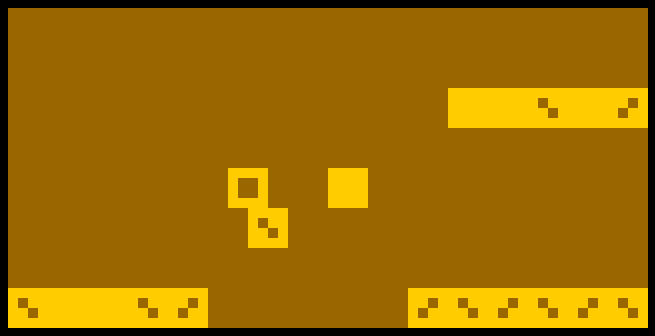

# Super Block

# 

[Play Super Block](http://johnearnest.github.io/Octo/index.html?key=yRH33CPo)

Super Block is a game written for Octojam, the game jam for the CHIP-8.

The CHIP-8 is a video game console emulator from the 1970s that has 4K of RAM and an extremely limited instruction set.

Super Block was written with the Octo macro assembler.
